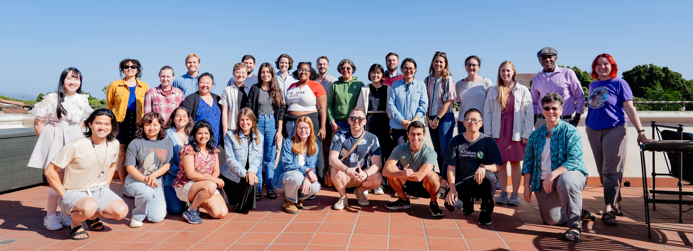

We have been overjoyed to work with a wide variety of early career researchers. They represent a breadth of disciplines and ecosystems but are united by being bright, creative, passionate scientists. To ensure they receive appropriate credit for their contributions to this course we've invited participants to have their GitHub profiles linked to the course website on this page. This is an opt-in model and as such there may be synthesis fellows who are not listed here but were valued members of the course community.

Fellows are ordered alphabetically by last name.

_Icon legend:  = GitHub |  = ORCID |  = website_

:::{.panel-tabset}
### 2026-27 Cohort

| <u>Cely Toro - Marvy</u> | <u>Medina - Yang</u> |
|:---:|:---:|
| _Ivan Mauricio Cely Toro_ -- [](https://github.com/mauriciocely) [](https://orcid.org/0000-0003-2008-681X) [](https://mauriciocely.github.io/) | _Nicholas Medina_ -- [](https://github.com/nmedina17) [](https://orcid.org/0000-0001-5465-3988)  |
| _Jared M. Collins_ -- [](https://github.com/jaredcoll) [](https://orcid.org/0000-0001-6785-6565)  | _Taylor Michael_ -- [](https://github.com/TaylorCMichael) [](https://orcid.org/0000-0002-5685-5396) [](https://taylorcmichael.weebly.com/) |
| _Emerson Conrad-Rooney_ --  [](https://orcid.org/0000-0001-7435-2832) [](http://econradrooney.com) | _Desneiges	Murray_ -- [](https://github.com/denimurray) [](https://orcid.org/0000-0003-2422-3287) [](https://denimurraybgc.weebly.com/) |
| _Adesuwa S. Erhunmwunse_ -- [](https://github.com/Adesuwaerhuns) [](https://orcid.org/0000-0001-9732-1481)  | _Kalea Nippert-Churchman_ -- [](https://github.com/krnippert) [](https://orcid.org/0009-0009-3542-9118)  |
| _Ileana Fenwick_ -- [](https://github.com/IleanaF)   | _Catherine Polik_ -- [](https://github.com/katiepolik) [](https://orcid.org/0000-0003-0440-1162)  |
| _Damian Forck_ -- [](https://github.com/DamianF100)  [](https://www.ntnu.edu/employees/damian.t.forck) | _Sa'ad A. A. Rafie_ -- [](https://github.com/srafie2) [](https://orcid.org/0000-0001-5199-1439)  |
| _Claudia Marcela Franco_ --    | _Olivia Ross_ -- [](https://github.com/olross4) [](https://orcid.org/0009-0008-6594-1596)  |
| _Yasas Gamagedara_ -- [](https://github.com/kanthsaz) [](https://orcid.org/0000-0002-6826-8420) [](https://kanthsaz.github.io/) | _Parikrama Sapkota_ --  [](https://orcid.org/0000-0003-0971-1872)  |
| _Alexandra Griffin_ --    | _Nathalie Ylenia Triches_ -- [](https://github.com/ntriches) [](https://orcid.org/0000-0002-3401-3403)  |
| _Abby E. Hay_ -- [](https://github.com/hayabby) [](https://orcid.org/0009-0003-5912-9140)  | _Rosario	Vidales_ -- [](https://github.com/vidalesr) [](https://orcid.org/0000-0001-7029-6925)  |
| _Lorenzo Maggio Laquidara_ -- [](https://github.com/MaggioLaquidara) [](https://orcid.org/0009-0003-3347-0703)  | _Sainfort Vital_ --  [](https://orcid.org/0009-0005-2034-6927)  |
| _Ida Lie-Nielsen_ --    | _Anita Weissflog_ -- [](https://github.com/DataAnita) [](https://orcid.org/0000-0002-9527-0964)  |
| _Asher Marvy_ -- [](https://github.com/ajmarvy) [](https://orcid.org/0009-0006-1690-6749)  | _Zhaoxun Yang_ -- [](https://github.com/znyang02) [](https://orcid.org/0000-0002-1021-9933)  |

### 2024-25 Cohort

| <u>Altman-Kurosaki - Lodge</u> | <u>Lloreda - Xu</u> |
|:---:|:---:|
| _Noam T. Altman-Kurosaki_ -- [](https://github.com/https://github.com/naltmank) [](https://orcid.org/https://orcid.org/0000-0001-5175-3334)  | _Carla López Lloreda_ -- [](https://github.com/https://github.com/carlalopezll) [](https://orcid.org/https://orcid.org/0000-0002-7983-1741)  |
| _Abigail Borgmeier_ -- [](https://github.com/https://github.com/aeborgmeier) [](https://orcid.org/https://orcid.org/0009-0003-7244-6255)  | _Evald Maceno_ -- [](https://github.com/https://github.com/Emaceno79) [](https://orcid.org/https://orcid.org/0009-0001-2873-4466)  |
| _Richard J. Brokaw_ -- [](https://github.com/https://github.com/rbrokaw) [](https://orcid.org/https://orcid.org/0000-0002-8504-0049)  | _L. McKinley Nevins_ -- [](https://github.com/https://github.com/lmnevins) [](https://orcid.org/https://orcid.org/0000-0001-6340-5900)  |
| _Ashley N. Bulseco_ -- [](https://github.com/https://github.com/abulseco) [](https://orcid.org/https://orcid.org/0000-0001-5322-3070) | _Pooja Panwar_ -- [](https://github.com/https://github.com/ppanwar11) [](https://orcid.org/https://orcid.org/0000-0002-2795-5996)  |
| _Allison Case_ -- [](https://github.com/https://github.com/allie-case)   | _Sierra B. Perez_ -- [](https://github.com/https://github.com/sbperez) [](https://orcid.org/https://orcid.org/0000-0002-7279-3201)  |
| _Francis A. Chaves_ -- [](https://github.com/https://github.com/Francis-Chaves) [](https://orcid.org/https://orcid.org/0000-0002-0013-6755)  | _Julianna J. Renzi_ -- [](https://github.com/https://github.com/juliannajollyrenzi) [](https://orcid.org/https://orcid.org/0000-0002-6187-8656)  |
| _Jeremy A. Collings_ -- [](https://github.com/https://github.com/jeremyacollings) [](https://orcid.org/https://orcid.org/0000-0003-0263-7171) [](https://jeremycollings.com/)  | _Kelsey J. Solomon_ -- [](https://github.com/https://github.com/kjsolomon) [](https://orcid.org/https://orcid.org/0000-0002-3646-4291)  |
| _Shu Han Gan_ -- [](https://github.com/https://github.com/moricandia) [](https://orcid.org/https://orcid.org/0000-0002-8699-3669)  | _James W. Sturges_ -- [](https://github.com/https://github.com/jwsturges1) [](https://orcid.org/https://orcid.org/0009-0005-1321-0466)  |
| _Jonathan Gewirtzman_ -- [](https://github.com/https://github.com/jgewirtzman)  [](https://www.jongewirtzman.com/) | _Taylor A. Walker_ -- [](https://github.com/https://github.com/twalker1999) [](https://orcid.org/https://orcid.org/0000-0002-2174-9569)  |
| _Katherine A. Hulting_ -- [](https://github.com/https://github.com/hultingk) [](https://orcid.org/https://orcid.org/0000-0003-1434-267X)  | _Junna Wang_ -- [](https://github.com/https://github.com/jnawang)   |
| _Guopeng Liang_ -- [](https://github.com/https://github.com/guopeng-liang) [](https://orcid.org/https://orcid.org/0000-0001-5514-785X)  | _Bethany L. Williams_ -- [](https://github.com/https://github.com/bethany-williams) [](https://orcid.org/https://orcid.org/0000-0002-0899-5132) [](https://bethany-williams.github.io/) |
| _Smriti Pehim Limbu_ -- [](https://github.com/https://github.com/Smritipehimlimbu) [](https://orcid.org/https://orcid.org/0000-0001-9086-7895)  | _Yiyang Xu_ -- [](https://github.com/https://github.com/Ian-Yiyang) [](https://orcid.org/https://orcid.org/0000-0002-7279-3201)  |
| _Joey Krieger Lodge_ -- [](https://github.com/https://github.com/joeykriegerlodge)   | -- |

 

:::
